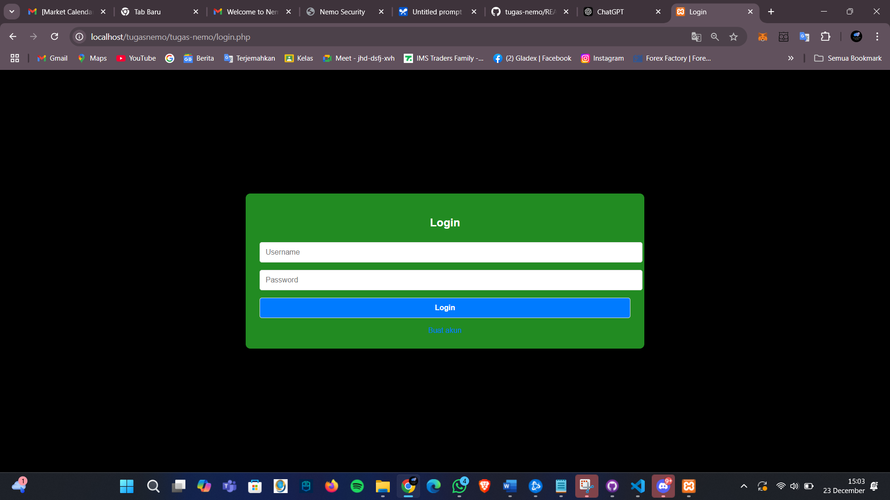

# README.md

## Deskripsi Proyek
web app ini  merupakan bentuk dari web app dengan kerentan sederhana untuk mencoba sqlinjesi dengan adanya halaman login dengan mengunakan  data user yang ada di database 

## Tampilan Web 
    halaman login 
  
  ---
## Fitur Utama

1. **Login:**
   - Memastikan bahwa username dan password tidak kosong sebelum memproses login.
   
2. **Otentikasi Pengguna:**
   - Memeriksa kecocokan username dan password dengan data yang disimpan di database.

3. **Pengelolaan Sesi:**
   - Menyimpan informasi pengguna yang berhasil login ke dalam sesi, termasuk `username`, `role`, dan `user_id`.

4. **Pengalihan Berdasarkan Role:**
   - Admin diarahkan ke `admindas.php`.
   - User diarahkan ke `userdas.php`.

5. **Pesan Kesalahan:**
   - Memberikan feedback kepada pengguna jika terjadi kesalahan seperti input kosong, username/password salah, atau role yang tidak valid.
 ## Fitur Pada Dasbord Admin 

 
 1. **fitur untuk merubah user biasa jadi user**
     pada ini admin dapat merubah role user melalui dasbord ke database 
     
## Struktur Kode

### 1. **Bagian Backend**
- Memulai sesi menggunakan `session_start()`.
- Memproses data form menggunakan metode `POST`.
- Menjalankan query SQL untuk memeriksa kredensial pengguna.
- Menyimpan data sesi untuk pengguna yang berhasil login.

### 2. **Bagian Frontend**
- Formulir login dengan input untuk username dan password.
- Pesan kesalahan ditampilkan jika ada masalah dengan login.
- Link untuk mendaftar akun baru menuju `register.php`.

## Cara Menggunakan

1. **Prasyarat:**
   - Pastikan server web seperti Apache dengan modul PHP aktif.
   - Database yang berisi tabel `data_user` sudah dibuat dan terhubung dengan file `db.php`.

2. **Langkah-Langkah:**
   - Salin semua file ke direktori server web Anda.
   - Pastikan file `db.php` berisi konfigurasi koneksi database yang benar.
   - Akses halaman login melalui browser.
   - Masukkan username dan password yang valid untuk login.

3. **Struktur Tabel `data_user` (Contoh):**
   ```sql
   CREATE TABLE data_user (
       id INT AUTO_INCREMENT PRIMARY KEY,
       username VARCHAR(50) NOT NULL,
       password VARCHAR(255) NOT NULL,
       role ENUM('admin', 'user') NOT NULL
   );
   ```

## Debugging
- Pesan debug ditambahkan di beberapa bagian untuk membantu proses pengembangan dan perbaikan jika terjadi masalah:
  - Saat input kosong.
  - Saat query SQL dijalankan.
  - Saat login berhasil atau gagal.

## Teknologi yang Digunakan
- **Bahasa Pemrograman:** PHP
- **Database:** MySQL
- **Front-End:** HTML, CSS


---

Skrip ini dirancang untuk memberikan dasar yang kuat bagi pengembangan sistem login yang lebih kompleks di masa depan.

## dasbord admin 
pada dasbord admin memiliki 2 fitur yakni untuk chat dan merubah role dari user yang ada 
dasbord admin ini
